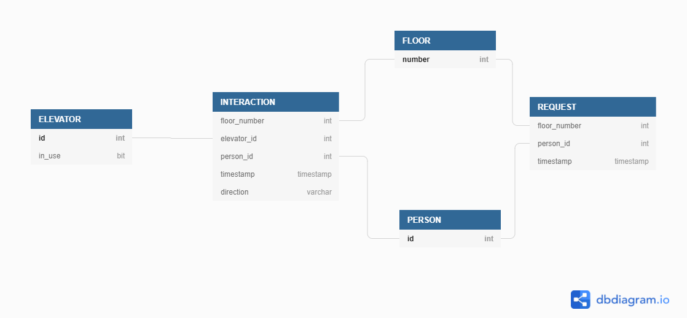

# Data model

The model was created with dbdiagram.io. The interactive model is available here: https://dbdiagram.io/d/613c62cc825b5b0146fd331e (includes the primary keys as well!).

**Note:** the table `CREATE` statements in this folder were generated from the _dbdiagram.io_ model <u>for SQL Server</u>. To use them for other databases, such as Snowflake or Postgres, they would need to be modified a little.

